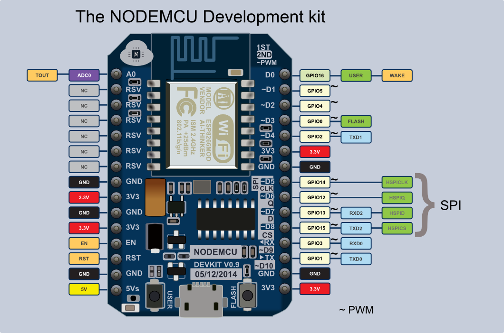
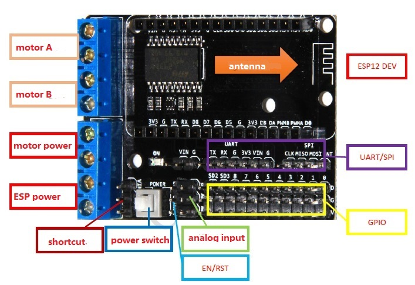
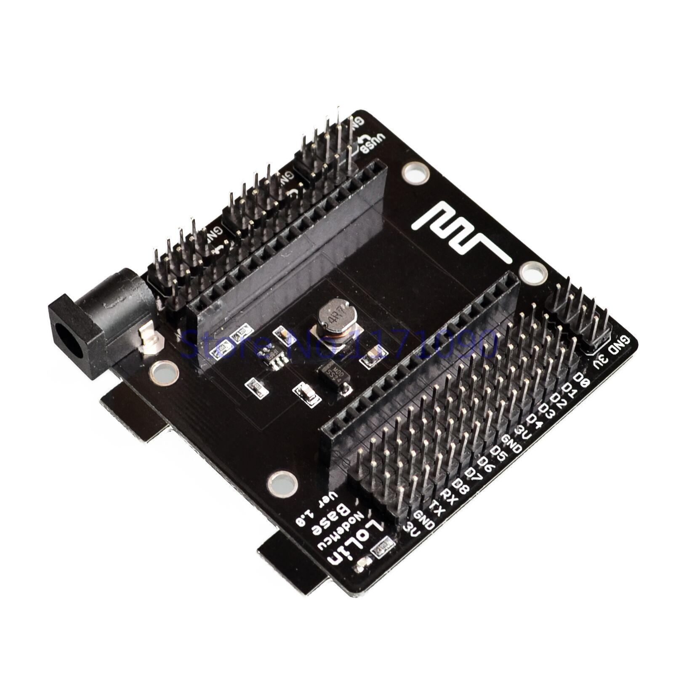

# NodeMCU

## Introducción

### ¿Qué es NodeMCU?

Es una placa de desarrollo que facilita el uso del ESP12-E

[Especificación](https://github.com/nodemcu/nodemcu-devkit-v1.0)

### ¿Qué es ESP8266?

### ¿Tiene arduino los días contados?

### ¿En qué se programa?

#### LUA

#### Comandos AT

#### C++ desde el IDE de Arduino

## Voltajes

Los chips ESP8266 y ESP12-E funcionan a 3.3v

## Pinout

Los pines con ~ pueden usarse como PWM y por tanto controlar servos

Destacar el pin A0 que es una entrada analógica (ADC)

Existen varias versiones y es importante saber qué versión tiene nuestra placa

### Versiones

Existen muchas variantes alrededor de la [especificación original](https://github.com/nodemcu/nodemcu-devkit-v1.0)

#### V1

Los pines del lado derecho no se utilizan

#### V2

Los pines del lado derecho ya se utilizan

#### V3

## Shields

Se trata de placas que nos facilitan la conexión de otros componentes y además proporcionan una forma más sencilla de alimentar la placa

### MotorShield

* Usa el famoso L293D para controlar 2 motores DC

* Facilita mucho la conexión de servos y/o otros componentes (como los de Ele cfreaks o Bq)

* Alimentación ¿Rango?

¿URL?

### Break Board

* Facilita mucho la conexión de servos y/o otros componentes (como los de Ele cfreaks o Bq)

* Alimentación ¿Rango?

## Enlaces

[Workshop sobre NodeMCU y ESP8266](https://github.com/geekscape/nodemcu_esp8266/tree/master/workshop_1)

[Ejemplos en LUA](https://github.com/geekscape/nodemcu_esp8266/tree/master/examples)

[Referencia](https://github.com/geekscape/nodemcu_esp8266)

[SeeedStudio](http://www.seeedstudio.com/recipe/245-control-electrical-devices-from-your-web-browser.html?utm_source=EDM&utm_medium=EDM&utm_campaign=EDM20150531)
