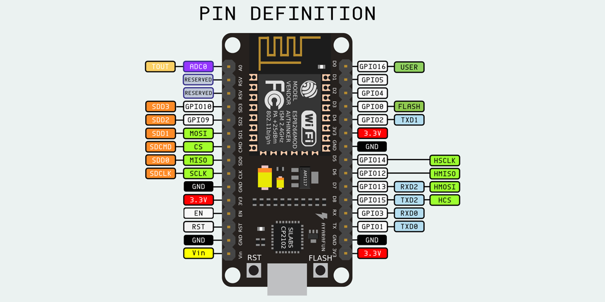

# NodeMCU

## Introducción

### ¿Qué es NodeMCU?

Es una placa de desarrollo que facilita el uso del ESP12-E

[Especificación](https://github.com/nodemcu/nodemcu-devkit-v1.0)

### ¿Qué es ESP8266?

### ¿Tiene arduino los días contados?

### ¿En qué se programa?

#### Comandos AT

#### LUA

#### ESPlorer

#### C++ desde el IDE de Arduino

Añadimos una fuente de board en la página de preferencias (Archivo->Preferencias)

    http://arduino.esp8266.com/stable/package_esp8266com_index.json

Ahora entramos en el gestor de Tarjetas ()

Una vez instalado ya tenemos disponible las placas de tipo ESP

Al seleccionarla accedemos a nuevas propiedades

y Ejemplos

Seleccionamos uno de ellos

Seleccionamos el puerto y subimos

Tarda bastante más que un típico programa de Arduino

#### SDK de expressif

## Voltajes

Los chips ESP8266 y ESP12-E funcionan a 3.3v

## Pinout

Los pines con ~ pueden usarse como PWM y por tanto controlar servos

En algunas placas se habla de Dx y en otras de GIOy (y la correspondencia entre ambos es ....)

Destacar el pin A0 que es una entrada analógica (ADC)

Existen varias versiones y es importante saber qué versión tiene nuestra placa

### Pinout ESP12-E

|NodeMCU	|ESP8266 GPIO	|  Functions
|---|---|---
|D0	|GPIO16	|LED_BUILTIN or BUILTIN_LED
|D1	|GPIO5	|I2C-SCL or CLK
|D2	|GPIO4	|I2C-SDA
|D3	|GPIO0	|SPI-RES or RST
|D4	|GPIO2	|SPI-DC
|D5	|GPIO14	|SPI-SCL or CLK
|D6	|GPIO12	|SPI-MISO
|D7	|GPIO13	|SPI-SDA or MOSI
|D8	|GPIO15	|SPI-CS or SS
|D9|	GPIO3	|Serial RX0
|D10|	GPIO1	|Serial TX0
|D11|	GPIO9
|D12|	GPIO10

(Recopilado de la página [threelectromania](http://theelectromania.blogspot.com.es/2016/02/how-to-program-esp8266-esp-12e-nodemcu.html))

### Versiones

Existen muchas variantes alrededor de la [especificación original](https://github.com/nodemcu/nodemcu-devkit-v1.0)

#### V1

Los pines del lado derecho no se utilizan

#### V2

Los pines del lado derecho ya se utilizan

#### V3

## Shields

Se trata de placas que nos facilitan la conexión de otros componentes y además proporcionan una forma más sencilla de alimentar la placa

### MotorShield

* Usa el famoso L293D para controlar 2 motores DC

* Facilita mucho la conexión de servos y/o otros componentes (como los de Ele cfreaks o Bq)

* Alimentación ¿Rango?

¿URL?

### Break Board

* Facilita mucho la conexión de servos y/o otros componentes (como los de Ele cfreaks o Bq)

* Alimentación ¿Rango?

## Enlaces

[Workshop sobre NodeMCU y ESP8266](https://github.com/geekscape/nodemcu_esp8266/tree/master/workshop_1)

[Ejemplos en LUA](https://github.com/geekscape/nodemcu_esp8266/tree/master/examples)

[Referencia](https://github.com/geekscape/nodemcu_esp8266)

[SeeedStudio](http://www.seeedstudio.com/recipe/245-control-electrical-devices-from-your-web-browser.html?utm_source=EDM&utm_medium=EDM&utm_campaign=EDM20150531)
